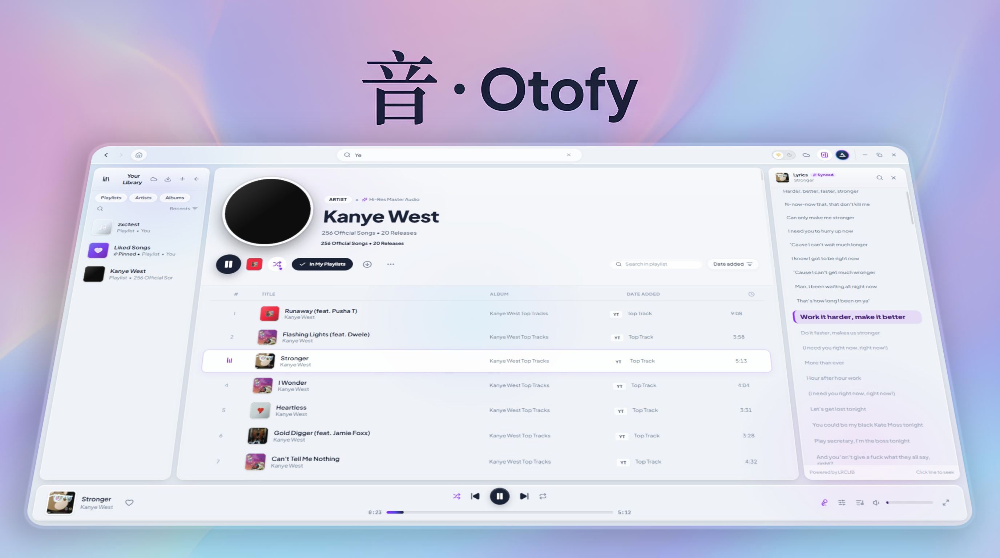
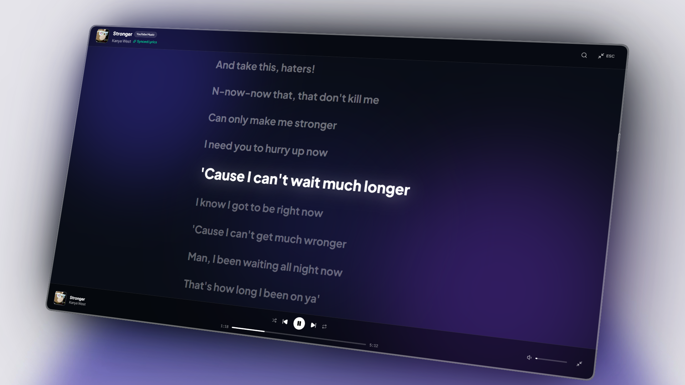

<div align="center">

  <h1>音 · Otofy</h1>
  <p><strong>Pure Sound. Zero Tracking. No Subscriptions.</strong></p>

  <p>
    <em>Oto (音 - Sound) meets effortless streaming.</em><br>
    A lightweight, privacy-focused desktop alternative to Spotify, engineered with clean Japanese minimalism.
  </p>

  <p>
    
    
    
    
    
  </p>

  <br />
</div>

---

### ⛩️ Why Otofy?

Streaming platforms have become heavy, bloated with podcasts and algorithmic clutter, restricted by paywalls, and aggressive with telemetries. 

**Otofy** is built as a breath of fresh air — a fast, modern alternative inspired by Spotify's fluid experience, but stripped of everything unnecessary. It streams high-quality music directly from **YouTube Music** and **SoundCloud** with zero audio ads, zero forced registrations, and complete privacy.

* **No Accounts Required** — Launch the app and immediately start listening. No emails, no passwords, no behavioral profiling.
* **100% Local Storage** — Your library, custom playlists, and listening history live directly on your machine. You truly own your music data.
* **Clean & Distraction-Free** — A pure liquid-glass aesthetic with high contrast, calm typography, and zero visual noise.

---

### ✨ Features

#### 🎵 Boundless Streaming
- **Dual Engine Playback**: Combines official studio releases from **YouTube Music** with indie gems, remixes, and bootlegs from **SoundCloud**.
- **Instant Source Filter**: Seamlessly filter searches by `MIXED`, `YT`, or `SC` on the fly.
- **Parametric 10-Band Equalizer**: Fine-tune your frequency curve or pick instant presets (Bass Boost, Vocal, Acoustic, Electronic, Rock).

#### 📻 Daily Genre Mixes & Discovery
- **Daily Refreshed Genre Selections**: Curated mixes broken down by genre (Electronic, Hip-Hop, Indie, Lo-Fi, Metal, Rock, etc.) automatically regenerated every 24 hours so you always have fresh audio ready to go.
- **Procedural Radios**: Generate infinite dynamic artist mixes and smart radio stations on the fly.

#### 📜 Interactive Synchronized Lyrics
- **Sidebar & Fullscreen Modes**: Keep lyrics docked in a subtle sidebar while browsing, or launch the cinema fullscreen mode with ambient gradient lighting.
- **Click-to-Seek Karaoke**: Lyrics are fully synced with sub-second timestamps. **Click on any line or phrase**, and playback instantly jumps to that exact moment.

#### 📁 Playlist Freedom
- **Create & Curate**: Organize tracks into customized local collections.
- **Share & Backup**: Export your playlists to JSON and share them with friends or restore them on any computer in one click.

---

<div align="center">
  
  <p><em>Real-time synchronized lyrics with dynamic ambient glow and instant click-to-seek playback.</em></p>
</div>

---

### 🗺️ Roadmap

- [ ] **Account Integrations**: Optional login for YouTube Music and SoundCloud to auto-sync existing cloud libraries and favorites.
- [ ] **Discord Rich Presence**: Share current track, artist, and playback progress in your Discord status.
- [ ] **Offline Cache**: Smart local audio caching for stutter-free playback on unstable networks.
- [ ] **Direct Track Downloads**: Native in-app audio downloader to save high-bitrate tracks locally for offline listening.

---

### 🚀 Getting Started

#### Prerequisites
* [Node.js](https://nodejs.org/) (v18 or newer)
* npm, pnpm, or yarn

#### Setup & Commands

```bash
# 1. Clone the repository
git clone https://github.com/prfctcondition/otofy.git
cd otofy

# 2. Install dependencies
npm install

# 3. Development
npm run dev              # Start web dev server
npm run electron:dev     # Launch Electron desktop window

# 4. Production Build (Windows / macOS / Linux)
npm run build
npm run electron:build
