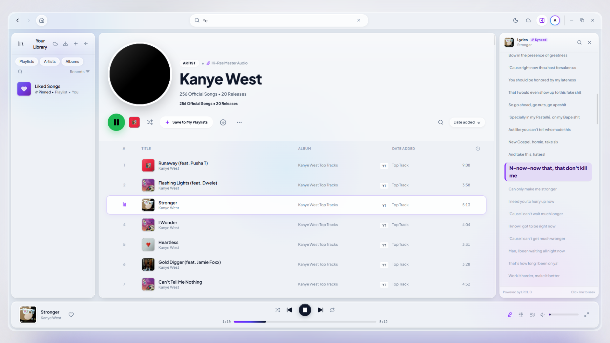
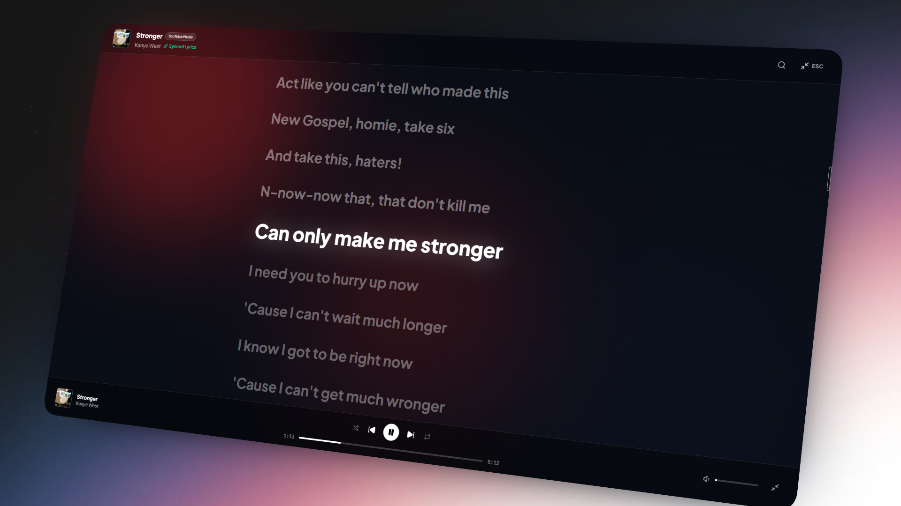

<div align="center">

  

  <br />
  <br />

  <h1>音 · Otofy</h1>
  <p><strong>Pure Sound. Zero Tracking. No Subscriptions.</strong></p>

  <p>
    <em>The ultimate privacy-first desktop music streaming and offline player.</em><br>
    Engineered with Japanese aesthetic minimalism, a studio-grade dual audio engine, and zero compromises.
  </p>

  <p>
    <a href="https://github.com/prfctcondition/otofy/releases/latest"></a>
    
    
    
    
    
    <a href="LICENSE"></a>
  </p>

  <br />

  <p>
    <a href="https://github.com/prfctcondition/otofy/releases/latest">
      
    </a>
  </p>

  <br />
</div>

---

## ⛩️ Why Otofy?

Modern music streaming has lost its way. Mainstream platforms are bloated with podcasts, forced algorithmic feeds, intrusive audio commercials, paywalled basic controls, and relentless tracking of your listening habits.

**Otofy was built as a pure, uncompromising rebellion against the bloat.**

It delivers the fluidity and elegance of a flagship music service while placing **complete ownership and privacy back into your hands**. Stream millions of tracks directly from YouTube Music and SoundCloud without ever creating an account, batch-download entire libraries for offline listening with embedded metadata, and migrate your playlists from any platform in seconds.

---

## ♟️ What Sets It Apart

### 🔓 1. Zero Accounts, Zero Tracking, Zero Ads
* **No Sign-Up Required**: Launch Otofy and play music immediately. No emails, no passwords, no phone numbers, and no behavioral profiling.
* **100% Local & Private**: Your liked songs, playlists, cached albums, and listening history live strictly on your machine in IndexedDB.
* **Ad-Free Streaming**: Clean, uninterrupted audio playback out of the box.

### 📥 2. High-Speed Batch Playlist Downloader
* **One-Click Playlist Downloads**: Save entire albums or 200+ track playlists directly to your hard drive with a single click.
* **Integrated FFmpeg Transcoding Engine**: Bundled high-performance audio engine converts streams into pristine audio files with zero external software needed.
* **Full ID3 Tag & Cover Art Embedding**: Downloaded tracks automatically include embedded high-resolution (500x500) artwork, artist, title, album, and track indices.
* **Smart Concurrency Queue**: Background download manager throttles parallel workers (up to 3 simultaneous streams) with live progress tracking, per-track pause/resume/cancel, and batch controls to keep your PC smooth.
* **True Offline Mode**: Switch to your downloads library and enjoy full playback without any internet connection.

### 🔄 3. Universal Multi-Platform Importer & Link-Free Sharing
* **Spotify Importer**: Paste any Spotify public playlist URL. Otofy extracts the tracklist and metadata, searches across high-fidelity sources, and reconstructs the playlist locally.
* **YouTube Music & SoundCloud Support**: Import playlists from YouTube Music or SoundCloud directly via URL.
* **Link-Free Playlist Sharing (Portable Codes)**: Share your curated collections without generating web links, relying on third-party cloud servers, or exposing your account. Export and import playlists instantly using compact, offline-friendly JSON share codes.
* **Smart Matching Engine**: Employs fuzzy string matching, multi-artist parsing (`feat.`, `ft.`, `&`, `,`), and duration verification to find the exact studio version of every track.
* **Interactive Conflict Resolver**: If a track has multiple versions or rare remixes, an interactive candidate modal lets you audition, replace, or skip tracks with one click.

### ☁️ 4. Bidirectional Cloud Playlist Synchronization
* **YouTube Music & SoundCloud Integration**: Connect your accounts in seconds to synchronize and manage your custom cloud playlists.
* **Seamless Two-Way Sync**: Add or delete tracks inside Otofy, and changes are instantly updated on YouTube Music and SoundCloud in real time.
* **Tombstone Protection Engine**: Advanced tombstoning ensures that deleted songs are never accidentally resurrected by background polling cycles.
* **Cross-Platform Protection**: Guardrails against mixing incompatible cloud tracks with instant one-click search redirection to locate tracks natively.

### 🌐 5. Boundless Dual-Engine Catalog & Proprietary Streaming Protocol
* **YouTube Music Engine**: Stream official studio albums, singles, remastered classics, and live sessions.
* **SoundCloud Engine**: Tap into millions of underground remixes, DJ sets, lo-fi beats, bootlegs, and indie tracks.
* **Proprietary Streaming Bypass Protocol**: Powered by a custom, private bypass protocol designed for seamless, resilient stream resolution, anti-bot resilience, and uninterrupted audio playback without rate-limits or IP restrictions.
* **Unified Discovery**: Seamlessly search both platforms simultaneously or filter results with instant `[ YT ]` and `[ SC ]` toggles.

### 🎛️ 6. Studio-Grade 10-Band Graphic Equalizer
* **10-Band Precision Filter Bank**: While mainstream desktop clients like Spotify restrict audio tuning to only 6 fixed sliders, Otofy provides a hardware-accelerated 10-band equalizer (32Hz to 16kHz) powered by Web Audio API biquad filters.
* **One-Click Presets**: Switch instantly between *Bass Boost*, *Vocal Clarity*, *Electronic*, *Rock*, *Acoustic*, and *Flat*.
* **Real-Time Soundstage**: Fine-tune your frequency curve from -12dB to +12dB with centered precision sliders and zero playback latency.

### ⚡ 7. Dual-Deck Audio Engine & Infinite Autoplay
* **Seamless Crossfading (0–12s)**: Powered by an A/B dual-deck audio pipeline, smoothly blending tracks together like a live radio DJ.
* **Infinite Radio Mode**: When your queue ends, Otofy automatically analyzes the acoustic profile of your last track and generates an endless queue of matching songs.

### 🎤 8. Interactive Synchronized Lyrics (Karaoke & Cinema View)
* **Universal Click-to-Seek Karaoke**: Click on any lyric line or phrase to instantly jump to that exact millisecond in the song. On mainstream services like Spotify, clicking lyrics to navigate playback is rare and restricted only to select songs where publishers manually configured timings; in Otofy, lyrics feature universal sub-second synchronized timestamps.
* **Ambient Cinema Fullscreen**: Immersive visualizer with dynamic lighting that extracts dominant color gradients from current album artwork.

### 📁 9. Power Library & Local Audio Discovery
* **Local Audio Scanner**: Point Otofy to any folder on your computer. It scans and indexes `.mp3`, `.flac`, `.opus`, and `.m4a` files with full metadata extraction.
* **Deterministic Recents & Library Sorting**: Recents sorting tracks strictly user-initiated interactions with deterministic ordering, eliminating random reordering during background sync.
* **Multi-Select Workflow**: Select multiple tracks at once (`Ctrl/Cmd + Click`, `Shift + Click`) to bulk-add to playlists, queue next, or download in batch.
* **Offline Album Snapshots**: Saved albums are securely snapshotted in local storage so you never lose your music or hit broken streaming tokens.

---

<div align="center">
  
  <p><em>Real-time synchronized lyrics with dynamic ambient glow and click-to-seek playback.</em></p>
</div>

---

## 🖥️ Platform Comparison

| Feature | Otofy | Spotify Free | Apple Music | YouTube Music | SoundCloud Free | Typical Offline Players |
| :--- | :---: | :---: | :---: | :---: | :---: | :---: |
| **Price** | **100% Free** | Free (Ad-Supported) | $10.99/mo (No Free Tier) | Free (Ad-Supported) | Free (Ad-Supported) | Free / Paid |
| **Account Required** | **❌ None** | ✔️ Required | ✔️ Apple ID Required | ✔️ Required | ⚠️ Required for Playlists | ❌ None |
| **Audio Ads** | **❌ Zero** | ⚠️ Every 15 mins | ❌ Zero (Paid Only) | ⚠️ Every 2 tracks | ⚠️ Frequent Audio Ads | ❌ Zero |
| **Batch Playlist Download** | **✔️ Unlimited** | ❌ Premium Only | ⚠️ Paid Only (DRM Locked) | ❌ Premium Only | ❌ Go+ Only | ❌ Manual files only |
| **Offline Playback & Tags** | **✔️ Yes (Embedded ID3 & 500x500 Artwork)** | ⚠️ Encrypted Cache | ⚠️ DRM Encrypted | ⚠️ Encrypted Cache | ⚠️ Mobile Cache Only | ⚠️ If tagged manually |
| **Link-Free Playlist Sharing** | **✔️ Portable Codes (No Links Needed)** | ❌ Web Links Only | ❌ Web Links Only | ❌ Web Links Only | ❌ Web Links Only | ⚠️ Manual File Copy |
| **Multi-Platform Import** | **✔️ Spotify, YT, SC, Codes** | ❌ No | ❌ Third-party paid tools | ❌ No | ❌ No | ❌ N/A |
| **Catalog Scope** | **Dual (YT Music + SoundCloud)** | Commercial Catalog | Commercial Catalog | YouTube Catalog | Remixes / Indie Only | Local Storage Only |
| **Graphic Equalizer** | **✔️ 10-Band Parametric** | ⚠️ Limited (6-Band on PC) | ⚠️ Presets Only (No Sliders on Windows) | ❌ No EQ on Desktop | ❌ No EQ | ⚠️ Varies (usually 5-Band) |
| **Interactive Synced Lyrics** | **✔️ Universal Click-to-Seek** | ⚠️ Rare (Author-dependent) | ✔️ Syllable-synced (Paid) | ⚠️ Static text only | ❌ No lyrics | ❌ Rare / Manual .lrc |
| **Telemetry & Tracking** | **❌ Zero (100% Private)** | ⚠️ Aggressive Profiling | ⚠️ Account Analytics | ⚠️ Google Ad Tracking | ⚠️ Behavioral Tracking | ❌ None |

---

## 🚀 Installation

### Windows Installer (Recommended)
1. Download the latest installer from the [Releases page](https://github.com/prfctcondition/otofy/releases/latest):
   - **`Otofy-Windows-installer.exe`**
2. Run the installer and launch Otofy from your Desktop or Start Menu.

---

## 🛠️ Building From Source

### Prerequisites
* [Node.js](https://nodejs.org/) (v18 or newer)
* npm, pnpm, or yarn
* Git

### Setup & Run
```bash
# 1. Clone the repository
git clone https://github.com/prfctcondition/otofy.git
cd otofy

# 2. Install dependencies
npm install

# 3. Launch Desktop Development Environment
npm run electron:dev
```

### Packaging Production Binary
```bash
# Build production desktop installer
npm run dist
```
The output installer will be generated in `release/Otofy-Windows-installer.exe`.

---

## 🗺️ Roadmap & What's Next

- [x] **Universal Playlist Importer**: Spotify, YouTube Music, SoundCloud, and JSON codes with conflict resolution.
- [x] **Two-Way Cloud Playlist Sync**: Real-time bidirectional synchronization with YouTube Music & SoundCloud accounts.
- [x] **Proprietary Streaming Bypass Protocol**: Private resilient streaming pipeline with anti-bot protection and zero interruptions.
- [x] **Batch Playlist Downloader**: Concurrent FFmpeg engine with ID3 & 500x500 artwork embedding.
- [x] **Link-Free Playlist Sharing**: Export and import playlists via portable Otofy JSON share codes without web links or external hosting.
- [x] **10-Band Graphic Equalizer**: Web Audio hardware filter bank with audio presets (up from standard 6-band limitations).
- [x] **Multi-Select & Advanced Sorting**: Bulk library operations, deterministic recents, and tracklist organization.
- [x] **Local Files Discovery**: Scan and play local `.mp3`, `.flac`, `.opus`, `.m4a`.
- [x] **Discord Rich Presence**: Broadcast currently playing track, artist, album art, and progress to Discord.
- [ ] **Native Global Media Keys & Windows SMTC**: Enhanced hardware keyboard controls when minimized to tray.

---

## 🍵 Support · お気持ち

Otofy is 100% free, open-source, and built on the conviction that music and convenience are fundamental human rights. There are zero subscriptions, audio ads, or trackers.

If Otofy brought harmony to your days, preserved your offline playlists, or simply gave you a peaceful listening experience, a humble cup of green tea is received with quiet gratitude:

<p align="center">
  <a href="https://ko-fi.com/prfctcondition">
    
  </a>
  <br />
  <sub><a href="https://ko-fi.com/prfctcondition">ko-fi.com/prfctcondition</a></sub>
</p>

---

## 📄 License

Distributed under the [MIT License](LICENSE). Built for music lovers who cherish privacy, sound fidelity, and freedom.

p.s пользуйся моим приложением или я убью тебя
